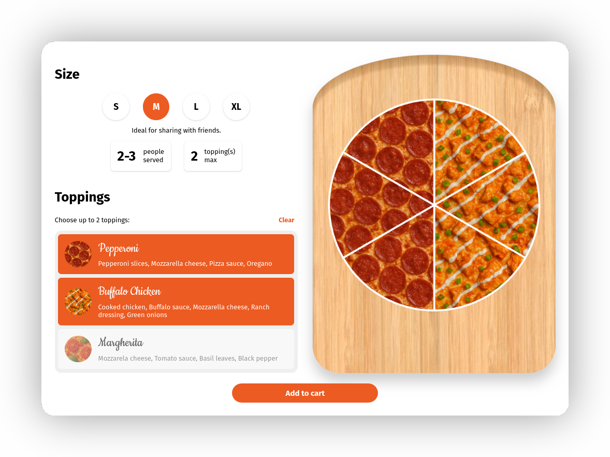

# PizzaPicker

An interactive and intuitive pizza picker.

[Try it out live!](https://purewave0.github.io/pizza-picker)

- Choose your pizza's size
- Choose your pizza's toppings
- See info according to the selected size
- Preview your pizza in real time
- See final order as JSON
- 8 toppings to choose from — and very easy to add more
- Responsive
- Includes an easter egg[[1]](#easter-egg)

## Credits

- [ChartJS](https://www.chartjs.org/) to render the pizza;
- [MicroModal](https://micromodal.vercel.app/) for the Order modal dialog;
- [Free Icons](https://free-icons.github.io/free-icons) and [Google's Material Symbols](https://fonts.google.com/icons) for the SVG icons;
- [Wikipedia](https://en.wikipedia.org/) for the ingredients lists;
- [ChatGPT](https://chatgpt.com/) for generating the toppings textures (see below).

## Textures

My initial plan was to download seamless textures of each topping, however a. I could
only find the most popular toppings; and b. they were split across different packs, so
they weren't very consistent with each other.

I considered drawing them myself, which would be fun, but as I don't have a graphics
tablet, I wasn't satisfied with the results. *(I still plan on drawing them once I get
one!)*

So I've resorted to generating the textures using OpenAI's DALL-E 3 model. My initial
prompt was `Create an image of a seamless pepperoni pizza texture`, and the result was
actually really good. So I gave it that same image as a reference for other toppings
with the following prompt: `Create an image of a seamless <topping> pizza texture based
on this pepperoni pizza texture`. Even after some slight tweaks, they're still not
perfectly seamless, but I'm happy with the results for now.

---

Wait a moment after you open the Order modal ;)
